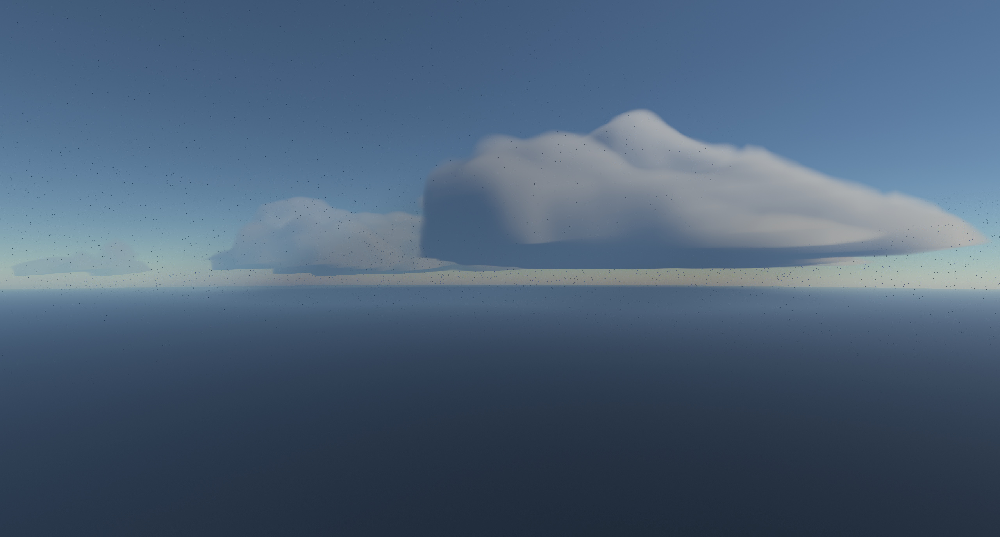

# Mulen
Mulen is an atmosphere-with-clouds renderer written in C++, rendering via OpenGL. It's still in its initial development phase, which means visuals and performance (as well as everything else, really) are in flux.

For now, the necessary libraries (GLFW, Glad, GLM, ImGui) have to be manually copied into a lib directory inside the project root directory.

To do: more sensible CMake-employing dependency management.

Ray-tracing an atmosphere volume with adaptively-higher level of detail depending on the camera location, lit by first-order light scattering:

(altitude: 1578 m, total frame time (including non-Mulen-specific overhead of approximately 0.5 ms): 19.6 ms. Higher-detail rendering has yet to be optimised, and the continuous loading takes at least a couple of ms per frame. Much optimisation remains to be done. GPU: Nvidia GTX 1080 Ti)
