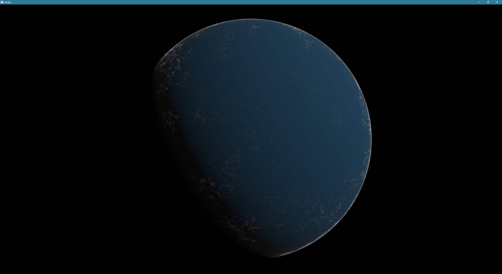

# Mulen
Mulen is an atmosphere-with-clouds renderer written in C++, rendering via OpenGL. Or it *will* be one, in the near future.

For now, the necessary libraries (GLFW, Glad, GLM, ImGui) have to be manually copied into a lib directory inside the project root directory.

To do: more sensible CMake-employing dependency management.

Ray-tracing an atmosphere volume 512 voxels across (at its widest; only nodes within the atmosphere shell are loaded in the octree, thereby saving most of the memory that would be wasted if a simple 512^3 texture were used instead):

To come: lighting (atmospheric scattering).
