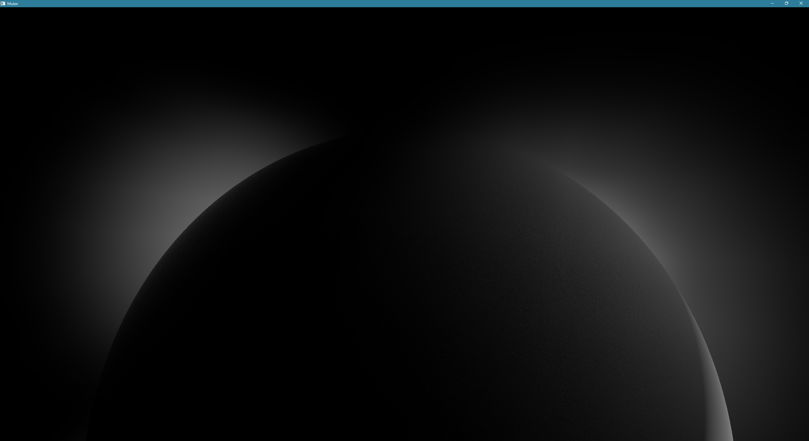

# Mulen
Mulen is an atmosphere-with-clouds renderer written in C++, rendering via OpenGL. Or it *will* be one, in the near future.

For now, the necessary libraries (GLFW, Glad, GLM, ImGui) have to be manually copied into a lib directory inside the project root directory.

To do: more sensible CMake-employing dependency management.

Ray-tracing a 16^3 voxel volume (i.e. the lowest octree level of detail):

