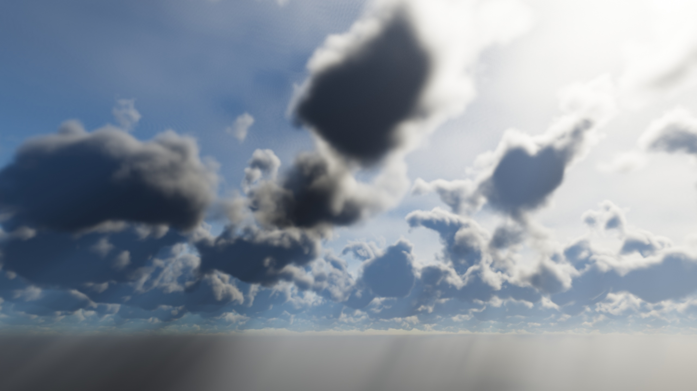

# Mulen
Mulen is an atmosphere-with-clouds renderer written in C++, rendering via OpenGL. It's still in its initial development phase, which means visuals and performance (as well as everything else, really) are in flux.

Libraries on which Mulen relies:

* [GLFW](https://github.com/glfw/glfw/) for window creation and low-level input handling.
* [glad](https://github.com/Dav1dde/glad) for loading OpenGL (extension) functions.
* [GLM](https://github.com/g-truc/glm/) for mathematics.
* [ImGui](https://github.com/ocornut/imgui) to display information and allow for adjusting parameters during runtime.
* [LodePNG](https://github.com/lvandeve/lodepng) to save screenshots.
* [json](https://github.com/nlohmann/json) to record and load benchmark data.

For now, the necessary libraries (GLFW, glad, GLM, ImGui) have to be manually copied into a lib directory inside the project root directory.

To do: more sensible CMake-employing dependency management (and the necessary portions of glad and ImGui included directly in this repository).

Ray-tracing an atmosphere volume with adaptively-higher level of detail depending on the camera location, lit by first-order light scattering:

(Admittedly extreme memory and computation time used for rendering the shown image, despite still obvious artefacts due to "low" voxel resolution. Somewhere around 5 FPS (though more moderate settings can result in real-time performance). GPU: Nvidia GTX 1080 Ti)
